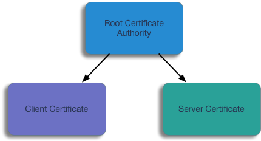

# TLS authentication in Python gRPC

## Intro

I've always had a fascination with network programming; its what got me into SRE and DevOps work originally. In a previous job, we built all of our services (micro and otherwise) around HTTP, REST, and JSON. This worked well: all languages had an HTTP client (even a crappy one) and all languages had a JSON parser (even a crappy one). But it always meant you had to serialize and marshal your data by hand, and each language handled the client/server contract just a bit differently.

We also had a need to send data and events between geographically disparate regions to keep the large system in sync. Obviously we had to encrypt everything going over the public Internet, and we had to identify clients to servers and servers to clients using SSL/TLS. We did the TLS processing at the front-end load-balancers; it was effective if a bit clumsy.

gRPC has pretty much solved all of these issues by creating a strong API contract between clients and servers through the use of Protocol Buffers, implementing the network programming semantics across multiple languages, and using TLS to secure the whole thing.

There are some great examples of doing Server authentication and identification in Python gRPC (like the one at [Sandtable](https://www.sandtable.com/using-ssl-with-grpc-in-python/), and I'd found some decent examples of doing mutual TLS authentication in other languages (like this [Go example](https://bbengfort.github.io/programmer/2017/03/03/secure-grpc.html)), so I decided to just extrapolate this into Python.

## TLS Basics



A quick refresher: TLS/SSL works through chains of trust, or transitive trust. If I (or my machine, or process) trust a particular certificate authority, I therefor trust the certificates that it has generated. This trust is implicit in browsers on operating systems: every browser and/or operating system has a 'Trusted Roots' certificate store that it uses to confirm the trust of HTTPS servers on the internet.  If you received an SSL/TLS server certificate from, say, [Let's Encrypt](https://letsencrypt.org), [GoDaddy](https://godaddy.com), or other public certificate authorities, browsers and operating systems will automatically trust the veracity of that server certificate.

In our example here, we are creating our own certificate authority (CA), and have inform to the client about the CA certificate so that it can trust the server certificate presented by our server process.

In terms of server certificates, we also have to see that the server name that we connect to is also the server name mentioned in the server certificate.

## Generate Certificates

For the purpose of this example, we will be creating an extremely basic PKI Infrastructure using CloudFlare's [CFSSL](https://cfssl.org). Specifically, we will be using the `cfssl` and `cfssljson` tools, which can be downloaded [here](https://pkg.cfssl.org).

The config files in the `ssl` directory intended to be modified, but they can also be used as-is for demonstration purposes.

### Generate CA Certificate and Config

```sh
cd ./ssl
cfssl gencert -initca ca-csr.json | cfssljson -bare ca
```

This generates the `ca.pem` and `ca-key.pem` files. The `ca.pem` file will be used by both the client and the server to verify each other.

### Generate Server and Client certificates

#### Server Certificate

```sh
cd ./ssl
cfssl gencert -ca=ca.pem -ca-key=ca-key.pem -config=ca-config.json -hostname='127.0.0.1,localhost' server-csr.json | cfssljson -bare server
```

This creates the certificate and key pair to be used by the server.

**Note:** You can change the `hostname` parameter to the name or IP address of a server on your network, it just needs to match the server name that you connect to with the client.

#### Client Certificate

```sh
cd ./ssl
cfssl gencert -ca=ca.pem -ca-key=ca-key.pem -config=ca-config.json client-csr.json | cfssljson -bare client
```

When generating the client certificate and key pair, you will see the warning:

```
[WARNING] This certificate lacks a "hosts" field. This makes it unsuitable for
websites. For more information see the Baseline Requirements for the Issuance and Management
of Publicly-Trusted Certificates, v.1.1.6, from the CA/Browser Forum (https://cabforum.org);
specifically, section 10.2.3 ("Information Requirements").
```

This is expected and acceptable as the client certificate won't be used for server identification, only client identification (see note above).

## TLS Server Identification and Encryption

### Client trusts the certificate authority certificate, and thus the server certificate.

This is similar to the browser use-case, where the browser has (pre-installed) all of the public Certificate Authority certificates installed in the browser or system trust store.

In our case, we are generating our own CA certificate, and distributing it to both the client and the server. But when we are only doing one-way trust verification (the client verifies the identity of the server, but the server doesn't care about the identity of the client), the server does not necessarily need to present the CA certificate as part of its certificate chain.  In general, a server only needs to present enough of a certificate chain so that the client can ascend up the certificate to a certificate that is signed by one of the CA certificates trusted by the client already.

We can configure our server to use SSL with something similar to the following code snippet

```python
# Server snippet
server = grpc.server(futures.ThreadPoolExecutor(max_workers=10))
namer_pb2_grpc.add_NamerServicer_to_server(Namer(), server)
port = 9999
keyfile = 'server-key.pem'
certfile = 'server.pem'
private_key = open(keyfile).read()
certificate_chain = open(certfile).read()
credentials = grpc.ssl_server_credentials(
    [(private_key, certificate_chain)]
)
server.add_secure_port('[::]:' + str(port), credentials)

print('Starting server. Listening on port {}...'.format(port))
server.start()
```

And the client would look something like this:

```python
# Client snippet
server_port = 9999
server_host = 'localhost'
ca_cert = 'ca.pem'
root_certs = open(ca_cert).read()
credentials = grpc.ssl_channel_credentials(root_certs)
channel = grpc.secure_channel(server_host + ':' + str(server_port), credentials)
stub = namer_pb2_grpc.NamerStub(channel)
```

[Sandtable](https://www.sandtable.com/using-ssl-with-grpc-in-python/) has a well written post about building this kind of TLS gRPC server and client.

## TLS Client Identification and Authentication

### Client and Server trust the certificate authority, and therefor, each other

When the client connects to the server, it presents its own certificate during the TLS handshake with the server. The client verifies the server certificate by confirming that the certificate was signed and generated using our certificate authority. The server, in turn, does the same thing, and confirms that the client is presenting a certificate that is signed and generated by our certificate authority.

#### Mind the CA bundle

Note that you can pass a CA bundle (multiple CA certificates concatenated in a single file) to `grpc.ssl_server_credentials()`, and that means that your server will trust any client certificates signed by those CAs. If you put a Public CA certificate in that bundle (like one from GoDaddy, Symantec, GeoTrust, etc.) any certificate signed by one of those CAs will be acceptable to the server.

#### TO BE COMPLETED
