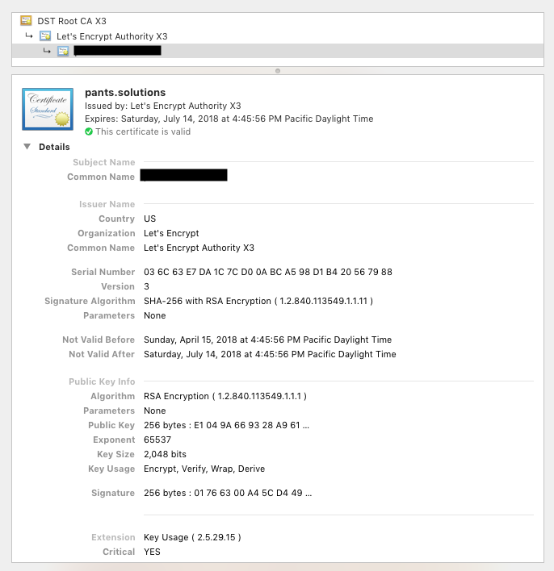

# TLS authentication in Python gRPC

## Intro

I've always had a fascination with network programming; its what got me into SRE and DevOps work originally.  In a previous job, we built all of our services (micro and otherwise) around HTTP, REST, and JSON. This worked well: all languages had an HTTP client (even a crappy one) and all languages had a JSON parser (even a crappy one).  But it always meant you had to serialize your data by hand, and each language handled the client/server contract just a bit differently.

We also had a need to send data and events between geographically disparate regions to keep the large system in sync.  Obviously we had to encrypt everything goig over the public Internet, and we had to identify clients to servers and servers to clients using SSL/TLS. We did the TLS processing at the front-end load-balancers, it was effective if a bit clumsy.

gRPC has pretty mushc solved all of these issues by creating a strong API contract between clients and servers through the use of Protocol Buffers, implementing the network programming semantics across multiuple languages, and using TLS to secure the whole thing.

I'd found some decent examples of doing mutual TLS authentication in other languages (like this [Go example](https://bbengfort.github.io/programmer/2017/03/03/secure-grpc.html)), so I had to extrapolate this into Python.

## TLS Basics


### Chain of Trust, Transitive Trust


### Root certificate stores

## Generate Certificates

### CFSSL

### Generate CA Certificate and Config
```sh
cd ./ssl
cfssl gencert -initca ca-csr.json | cfssljson -bare ca
```

### Generate Server and Client certificates

Note that the server name in the server certificate needs to be the same as the server name that you connect to. This can be accomplished by setting a name in your `/etc/hosts` file, or by having the name in DNS.

#### Server Certificate

```sh
cd ./ssl
cfssl gencert -ca=ca.pem -ca-key=ca-key.pem -config=ca-config.json -hostname='node04.example.com,node.example.com' server-csr.json | cfssljson -bare server
```

#### Client Certificate

```sh
cd ./ssl
cfssl gencert -ca=ca.pem -ca-key=ca-key.pem -config=ca-config.json client-csr.json | cfssljson -bare client
```

## TLS Server Identification and Authentication

### Client trusts the certificate authority cert, thus the server.
This is similar to the browser use-case

This has also been written about by Sandtable [here](https://www.sandtable.com/using-ssl-with-grpc-in-python/).

## TLS Client Identification and Authentication

### Client and Server trust the certificate authority, and therefor, each other